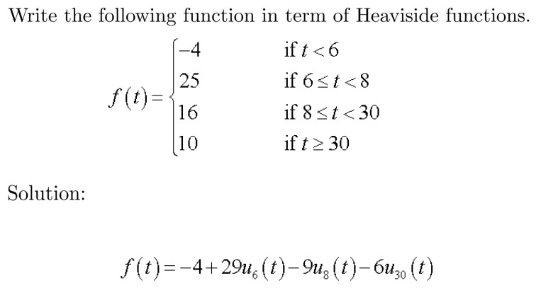
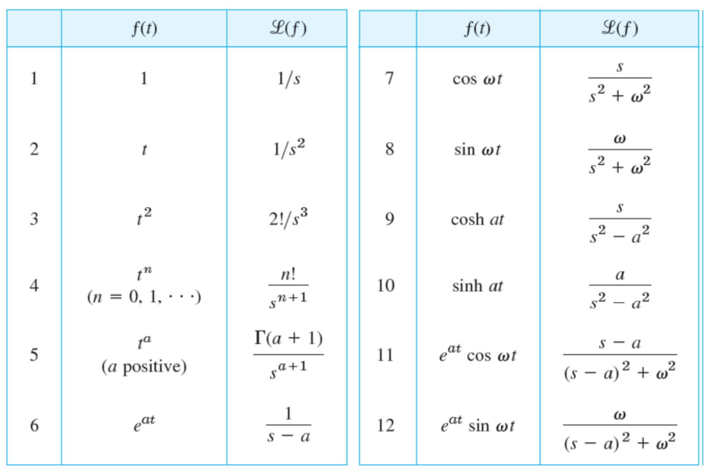
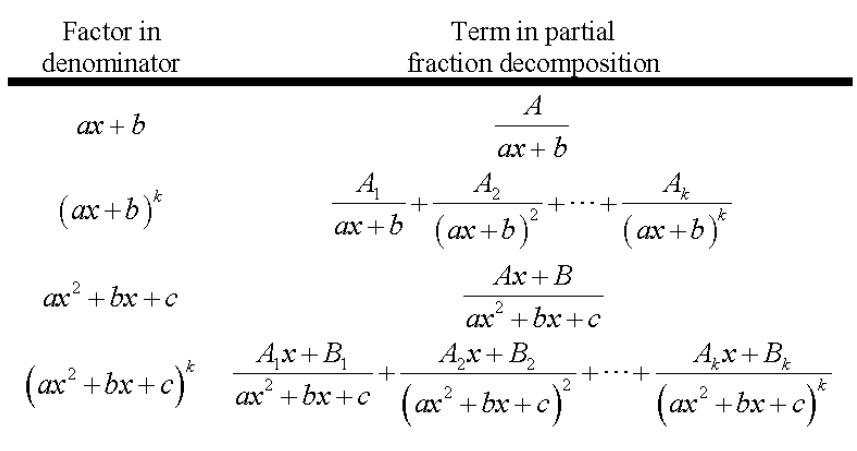
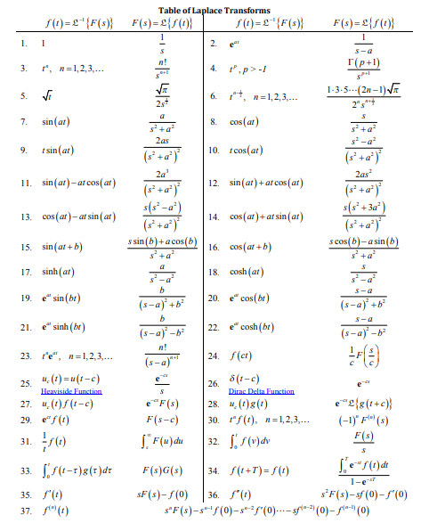

# Laplace

## Bentuk Umum

$$
F(s) = \mathcal{L} \{f(t)\} = \int_{0}^{\infty}e^{-st}f(t)dt
$$

## Sifat

### Linearity

$$
\mathcal{L} \{af(t)+bg(t)\} = aF(s) + bG(s)
$$

Contoh:

$$
\mathcal{L} \{cosh(at)\} = 
\mathcal{L} \{ \frac{1}{2}(e^{at}+e^{-at}) \} =
\frac{1}{2} (\frac{1}{s-a} + \frac{1}{s+a}) =
\frac{s}{s^{2} - a^{2}}
$$

$$
\mathcal{L} \{sinh(at)\} = 
\mathcal{L} \{ \frac{1}{2}(e^{at}-e^{-at}) \} =
\frac{1}{2} (\frac{1}{s-a} - \frac{1}{s+a}) =
\frac{a}{s^{2} - a^{2}}
$$

### Shifting

$$
\mathcal{L} \{e^{at}f(t)\} = F(s-a)
$$

$$
e^{at}f(t) = \mathcal{L}^{-1} \{ F(s-a) \}
$$

### Step Function

$$
\mathcal{L} \{u_{c}(t)f(t-c)\} = e^{-cs} F(s)
$$

contoh:

## Tabel Laplace `Pendek`

## Tabel Fraction Partial Decompotition

## Tabel Laplace `Panjang`

