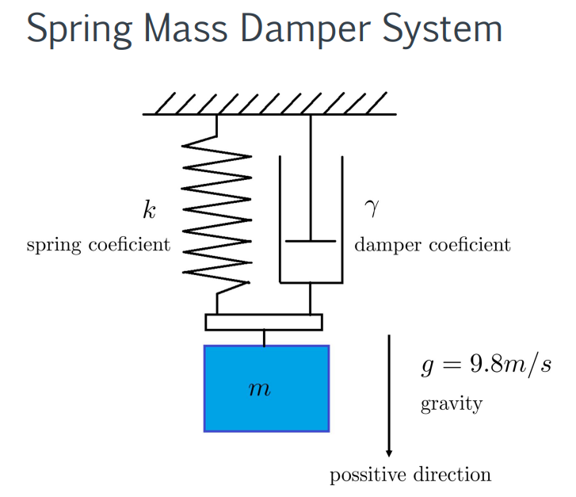
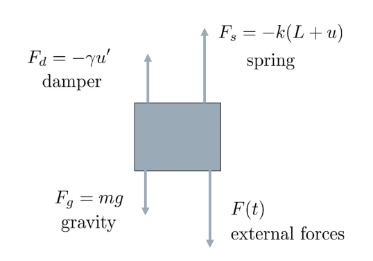

# Mechanical Vibration

## Bentuk Persamaan

$$
mu'' + \gamma u' + ku = mg - kL + F(t)
$$

### Ketika benda diam

$$
mg = kL
$$

- Maka didapatkan persamaan berikut:

$$
mu'' + \gamma u' + ku = F(t)
$$

### Ketika berada dalam keadaan `Free Undamped Vibration`

$$
F(t) = 0
$$

$$
\gamma = 0
$$

- Maka didapatkan persamaan sebagai berikut

$$
mu'' + ku = 0
$$

$$
r = \pm i \sqrt{\frac{k}{m}}
$$

$$
r = \pm  \omega_{0} i
$$

- Solusi Persamaan

$$
u(t) = c_{1}cos(\omega _{0}t) + c_{2}sin(\omega _{0}t)
$$

Atau bisa direpresentasikan sebagai

$$
u(t) = Rcos(\omega _{0}t -  \delta)
$$

$$
R = \sqrt{c_{1}+c_{2}}
$$

### Ketika berada dalam keadaan `Free Damped Vibration`

$$
F(t) = 0
$$

- Maka didapatkan persamaan sebagai berikut:

$$
mu''+\gamma u' + ku = 0
$$

$$ r_{1,2}=\frac{-\gamma \pm \sqrt{\gamma ^{2} - 4mk}}{2m}
$$

- Terdapat 3 kasus

#### Critical Damping `Double Roots`

$$
\gamma ^{2} - 4mk = 0
$$

$$
\gamma = \gamma _{CR} = 2 \sqrt{mk}
$$

Maka solusi persamaan adalah:

$$
u(t) = c_{1}e^{-\frac{\gamma t}{2m}} + c_{2}te^{-\frac{\gamma t}{2m}}
$$

#### Over Damping `Different Roots`

$$
\gamma ^{2} - 4mk > 0
$$

$$
\gamma > \gamma _{CR}
$$

Maka solusi persamaan adalah:

$$
u(t) = c_{1}e^{r_{1}t} + c_{2}e^{r_{2}t}
$$

#### Under Damping `Complex Roots`

$$
\gamma ^{2} - 4mk < 0
$$

$$
\gamma < \gamma _{CR}
$$

Maka solusi persamaan adalah:

$$
u(t) = c_{1}e^{\lambda t}cos(\mu t) + c_{2}e^{\lambda t}sin(\mu t) 
$$

$$
\lambda = \frac{-\gamma}{2m}
$$

$$
\mu = \frac{\sqrt{\gamma ^{2} - 4mk}}{2m}
$$
