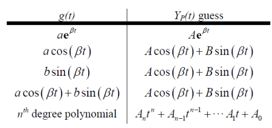
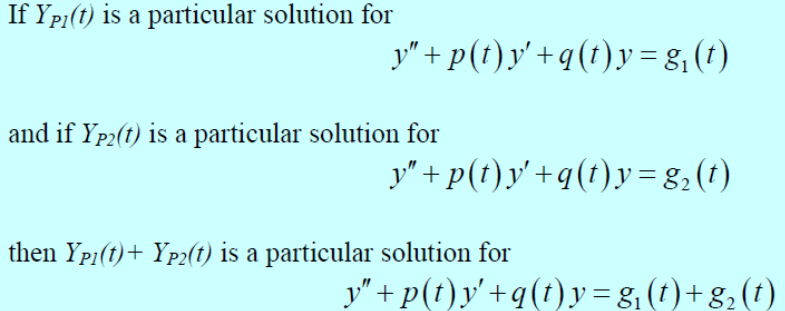

# Second Order Diferential Equation

## Homogenous

### Bentuk Persamaan

$$
ay'' + by' + cy = 0
$$

- Dengan memisalkan:

$$
y(t) = e^{rt}
$$
$$
y'(t) = re^{rt}
$$
$$
y''(t) = r^{2}e^{rt}
$$

- Maka didapatkan:

$$
e^{rt}(ar^{2}+br+c)=0
$$
$$
ar^{2}+br+c=0
$$

### Cara Penyelesaian jika `r1 tidak sama dengan r2`

$$
r_{1} \ne r_{2}
$$
$$
r_{1},r_{2} \in  \mathbb{R}
$$

1. Mencari nilai r1 dan r2

2. Substitusi r1 dan r2 pada persamaan berikut

$$
y(t)=c_{1}e^{r_{1}t} + c_{2}e^{r_{2}t}
$$

3. Turunkan persamaan di atas untuk mendapatkan `y'(t)`

4. Substitusi **Initial Value** pada `y(t)` dan `y'(t)` untuk mendapatkan c1 dan c2.

5. Substitusi c1 dan c2 pada persamaan `y(t)`

### Cara Penyelesaian jika `r1 dan r2 bilangan kompleks`

$$
r_{1} = \lambda + \mu i
$$
$$
r_{2} = \lambda - \mu i
$$

1. Mencari nilai r1 dan r2

2. Substitusi r1 dan r2 pada persamaan berikut

$$
y(t)=c_{1}e^{\lambda t}cos(\mu t) + c_{2}e^{\lambda t}sin(\mu t)
$$

3. Turunkan persamaan di atas untuk mendapatkan `y'(t)`

4. Substitusi **Initial Value** pada `y(t)` dan `y'(t)` untuk mendapatkan c1 dan c2.

5. Substitusi c1 dan c2 pada persamaan `y(t)`

### Cara Penyelesaian jika `r1 sama dengan r2`

$$
r_{1} = r_{2}
$$

1. Mencari nilai r

2. Substitusi r pada persamaan berikut

$$
y(t) = c_{1}e^{rt} + c_{2}te^{rt}
$$

3. Turunkan persamaan di atas untuk mendapatkan `y'(t)`

4. Substitusi **Initial Value** pada `y(t)` dan `y'(t)` untuk mendapatkan c1 dan c2.

5. Substitusi c1 dan c2 pada persamaan `y(t)`

## Non-Homogenous

### Bentuk Persamaan

$$
ay'' + by' + cy = g(t)
$$

### Bentuk Solusi

$$
y(t)=y_{c}(t) + Y_{p}(t)
$$

Dimana,

- yc adalah solusi complimentary atau solusi yang didapatkan dari persamaan **homogenous**

- Yp adalah solusi particular

### Tabel Particular Solution

### Cara Penyelesaian

1. Mencari `yc(t)`

2. Mencari **tebakan bentuk** `Yp(t)`

3. Apabila bentuk `yc(t)` dan `Yp(t)` sama, maka kalikan bentuk `Yp(t)` dengan t

4. Selesaikan persamaan `Yp(t)` dengan membandingkan bentuk tebakan terhadap `g(t)`

5. Substitusi `yc(t)` dan `Yp(t)` pada persamaan `y(t)`

6. Turunkan persamaan di atas untuk mendapatkan `y'(t)`

7. Substitusi **Initial Value** pada `y(t)` dan `y'(t)` untuk mendapatkan c1 dan c2.

8. Substitusi c1 dan c2 pada persamaan `y(t)`

### Rumus Tambahan

