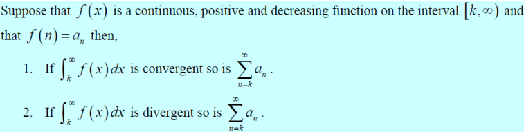
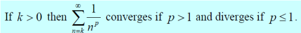
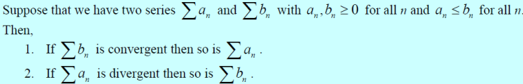
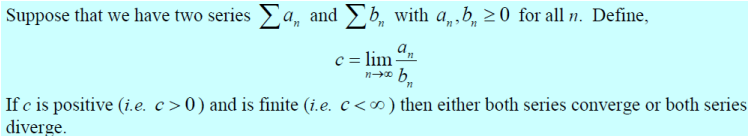
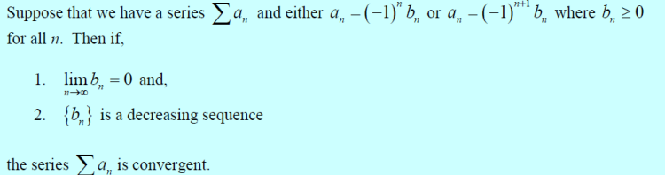
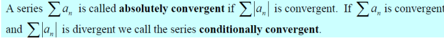
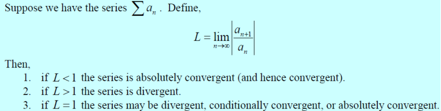
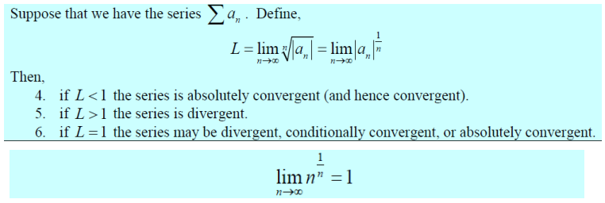

# Notasi

$$
s_{n} = a_{1} + a_{2} + ... + a_{n}
$$

$$
s_{n} = \sum_{i=0}^{n} a_{i}
$$

# Rumus Deret Geometri

## Deret Geometri untuk `r > 1`

$$
s_{n} = \frac{a(r^{n}-1)}{r-1}
$$

## Deret Geometri untuk `r < 1`

$$
s_{n} = \frac{a(1 - r^{n})}{1-r}
$$

## Deret Geometri tak hingga untuk `-1 < r < 0`

$$
s_{n}=\sum_{n=0}^{n} ar^{n} = \frac{a}{1-r}
$$

# Teorema

## Konvergensi

- Jika deret konvergen, maka baris juga konvergen

- Jika deret divergen, maka baris juga divergen

## Telescoping Series

$$
\sum_{n=0}^{\infty} \frac{1}{n^2+3n+2}=1
$$

## Harmonic Series (divergen)

$$
\sum_{n=1}^{\infty} \frac{1}{n}
$$

## Harmonic Series (konvergen)

$$
\sum_{n=1}^{\infty} \frac{(-1)^{n+1}}{n}
$$

# Rumus Sigma

## Perkalian Series

$$
( \sum_{i=0}^{n} a_{i}) ( \sum_{i=0}^{n} b_{i}) = ( \sum_{i=0}^{n} c_{i})
$$

$$
c_{n} = ( \sum_{i=0}^{n} a_{i}b_{n-i})
$$

## Pergeseran index

$$
\sum_{i=0}^{n} f(n)
$$
$$
\sum_{i=a}^{n} f(n - a)
$$

# Tes Konvergensi

## Integral Test

## P-series Test

## Comparison Test

## Limit Comparison Test

## Alternating Series Test

## Absolute Convergence Test

## Ratio Test

## Root Test

# Trik Tes Konvergensi

1. Deret pasti divergen jika

$$
 \displaystyle \lim_{n \to \infty} a_{n} \ne 0
$$

2. Gunakan Ratio Test jika menemukan bentuk berikut

$$
n!, k^{n}, n^{n}
$$

3. Gunakan Root Test jika menemukan bentuk berikut

$$
k^{n}, n^{n}
$$

4. Gunakan Limit Comparison Test jika menemukan bentuk berikut

$$
n^{k}
$$

5. Gunakan P-Series Test jika menemukan bentuk berikut

$$
\frac{1}{n^{p}}
$$

6. Kombinasikan Test lainnya dengan Comparison Test untuk bentuk yang lebih kompleks